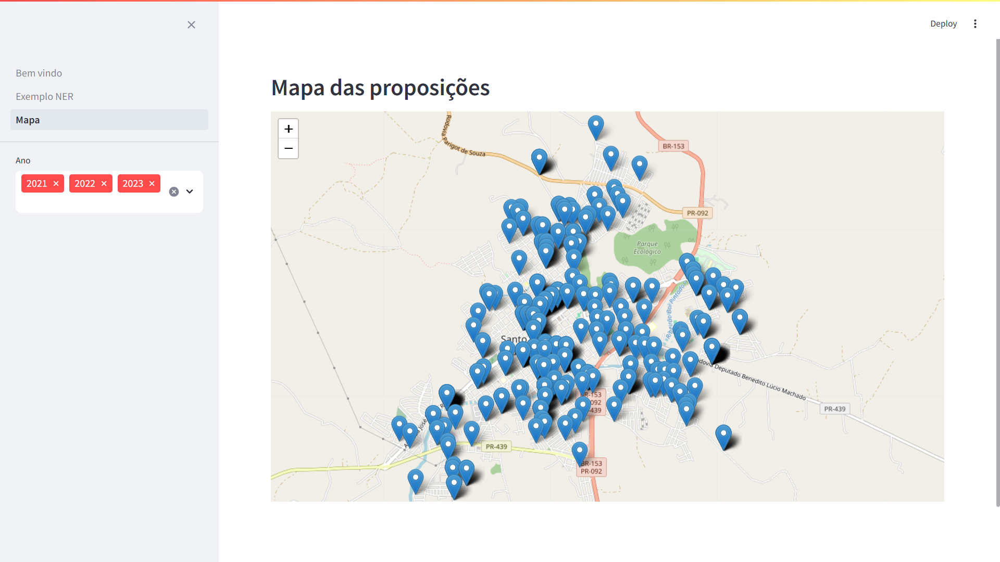

# spacy-ner-proposicao-legislativa

This repo implements a Named Entity Recognition example using with spaCy.

This work was presented at ''14º Encontro de Tecnologia da Comunidade GITEC'' organized by the Interlegis Work Group. The slides can be found somewhere in this repository.

I used [`spaCy`](https://spacy.io/) to trained a baseline model and [`streamlit`](https://streamlit.io/) to prototype an interface. Due to the rapidly development of these tools, this code can be outdate quickly. Said that, I must warning that I no longer intend to give manutantion to this project.

## See also

**História, homenagens e muita emoção marcam abertura oficial do 14° EnGITEC**. Available at <https://engitec.interlegis.leg.br/gitec/noticias/historia-homenagens-e-muita-emocao-marcam-abertura-oficial-do-14deg-engitec> Accessed 07.09.2024